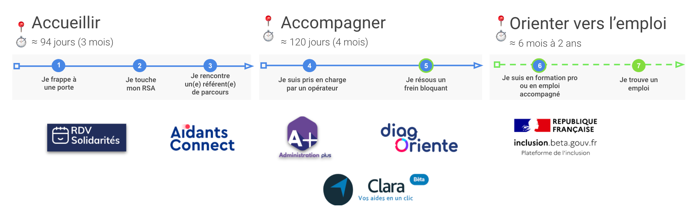

# Les services publics numériques pour l'insertion


N'hésitez pas nous contacter pour échanger sur le sujet ou solliciter notre aide en nous écrivant à l'adresse **insertion@beta.gouv.fr**


## Vous êtes une collectivité ou un acteur de l'insertion ?  

Parmi les services développés par beta.gouv.fr, on trouve des solutions pour l'accompagnement des personnes en insertion. L'enjeu de ce mini-site est de rendre visibles ces produits et services, et de vous aider à les prendre en main. 

## Nos engagements


**100% public** 

Les produits présentés ici sont financés par des collectivités, l'Etat, ou des administrations, et mis à disposition du plus grand nombre avec pour seul objectif de maximiser leur utilité sociale. Ils sont par défaut en _open source._ 



**Impact sur le réel** 

Tous les produits présentés sont opérationnels et ont des statistiques d'usage et d'impact disponibles. 



**En amélioration continue** 

Les services beta.gouv.fr ne sont pas issus de cahiers des charges. Jamais "finis", ni "en maintenance", ils continuent de s'améliorer tous les jours, selon les retours du terrain. 


## beta.gouv.fr, c'est quoi ?  

beta.gouv.fr est un programme qui accompagne depuis 2015 les ministères, administrations et collectivités territoriales dans le développement de solutions numériques centrées sur les usagers et en amélioration continue. 

Nous sommes également un réseau d'incubateurs qui partagent des valeurs et se reconnaissent dans le [manifeste](https://beta.gouv.fr/approche/manifeste) : 

1. Les besoins des utilisateurs sont prioritaires sur les besoins de l’administration ; 
2. L’équipe travaille sans préjuger à l’avance du résultat final et progresse en se confrontant le plus rapidement possible à de premiers utilisateurs ; 
3. Le mode de gestion de l’équipe repose sur la confiance.

