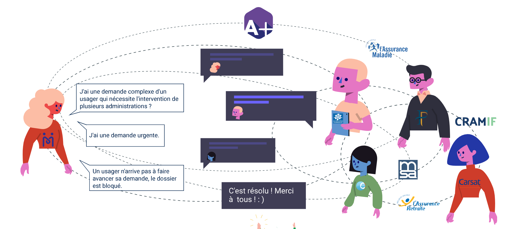

# Administration+

### Qu'est-ce que c'est ? 

Administration+ résout les blocages administratifs des usagers en permettant à des agents d'administrations différents de coopérer et d'instruire ensemble le problème. 


Le service est déployé dans les lieux France Services : 5 000 agents publics inscrits.   
  
Temps moyen de résolution des problèmes administratifs : `1 jour.` 


### Comment ça marche ? 

Lien vers le service en ligne : [aplus.beta.gouv.fr](https://aplus.beta.gouv.fr/)

### Par où commencer ? 

Vous êtes agent public et voudriez rejoindre Administration+ pour coopérer avec d'autres administrations et aider les usagers ? 

Pour l'instant, le produit est réservé à France Services. Pour réfléchir avec nous à de nouveaux usages, n'hésitez pas à solliciter l'équipe en écrivant à insertion@beta.gouv.fr.

