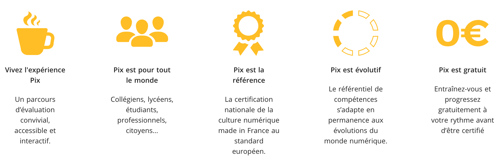

# Pix

### Qu'est-ce que c'est ? 

Pix est le service public en ligne pour évaluer, développer et certifier les compétences numériques. En autonomie ou accompagnés, vos publics peuvent diagnostiquer leur niveau de maîtrise du numérique.


Depuis 2017, plus de **500 000 utilisateurs** pix ont répondu à plus de **47 millions d'épreuves** adaptatives portant sur les 5 grands domaines sur 16 compétences numériques.   
  
**50 000 certifications Pix**, reconnues par l’Etat et le monde professionnel, ont été délivrées permettant de valoriser les compétences de leurs titulaires.


### Quels bénéfices pour les personnes accompagnées ? 

* Faire le point sur ses compétences numériques quel que soit son niveau ; 
* Développer des compétences numériques essentielles en milieu professionnel comme dans la vie quotidienne : recherches en ligne, manipulation de fichiers et de données, culture numérique. 

### Comment ça marche ? 



### Par où commencer ? 

Chacun peut créer un compte gratuitement et commencer à développer ses compétences sur [pix.fr](https://pix.fr/). 

Vous êtes un médiateur ou professionnel et souhaitez contacter l'équipe : consultez [cette page](https://pro.pix.fr/mediation-numerique). 

