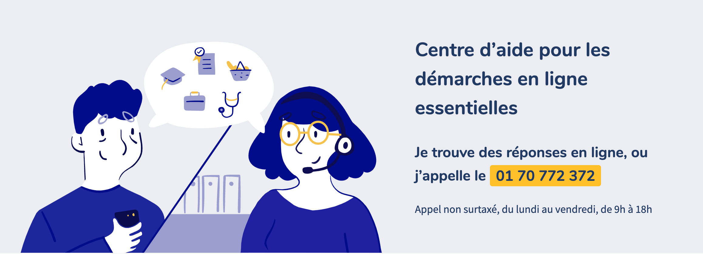

# Solidarité numérique

### Qu'est ce que c'est ? 

Solidarité numérique propose de l'aide à toutes les personnes qui rencontrent des difficultés pour effectuer des démarches en ligne ou utiliser Internet, en mobilisant des ressources et des réseaux de médiateurs sur tout le territoire. 

### Quel bénéfice pour la personne accompagnée ?

* Disposer d'une aide personnalisée, immédiate et efficace

### Comment ça marche ? 

Lien vers le service : [solidarite-numerique.fr](https://solidarite-numerique.fr/) ou [01 70 772 372](tel:0170772372)

### Par où commencer ? 

Pas besoin de s'inscrire, le site et le numéro de téléphone sont accessibles à tous. 

Vous voulez proposer une nouvelle ressource de médiation numérique ?   [suivez ce lien](https://solidarite-numerique.fr/nouvelle-ressource) ! 

